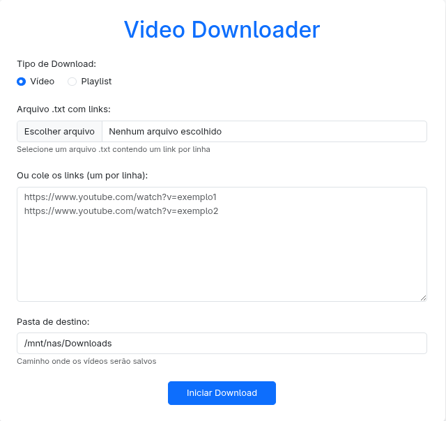

# Video Downloader

Uma aplicação Dockerizada para download de vídeos de plataformas como YouTube e outros sites compatíveis.

## 📋 Pré-requisitos

- Docker
- Docker Compose

## Como usar

### 1. Iniciar a aplicação

Execute o comando abaixo dentro da pasta do projeto:

```bash
docker-compose up -d
```

### 2. Parar a aplicação

Para parar o container:

```bash
docker-compose down
```

### 3. Atualizar a aplicação

Caso tenha alterações no container:

```bash
docker-compose pull
```

## Configuração de permissões do Docker (se necessário)

Se você encontrar problemas de permissão, execute os comandos abaixo:

### Adicionar usuário ao grupo docker

```bash
sudo usermod -aG docker $USER
```

### Aplicar as alterações

```bash
newgrp docker
```

## Interface



## Funcionalidades

A aplicação funciona com qualquer site que siga as mesmas regras do YouTube.

### 1. Download de vídeo único
- Selecione a opção **Video**
- Cole o link do vídeo na caixa de texto

### 2. Download de playlist
- Selecione a opção **Playlist**
- Cole o link da playlist na caixa de texto

### 3. Download via arquivo de texto
- Carregue um arquivo `.txt` contendo os links
- O arquivo deve conter apenas um tipo de link (direto ou playlist)
- Cada link deve estar em uma linha separada

## Customização
- No *app.py* voce customizar o caminho padrão de salvamento
```bash
DEFAULT_PATH = "/mnt/nas/Downloads"
```
    -  Ajuste tambem no *download_videos.py*
```bash
download_path = sys.argv[2] if len(sys.argv) > 2 else "/mnt/nas/Downloads"
```

## Observações

- Certifique-se de que os links sejam válidos e acessíveis
- Verifique se o firewall ou antivirus nãoe esta bloqueando a porta usanda (padrão: 5000)
- Para playlists, todos os vídeos serão baixados sequencialmente
- Os downloads são salvos no diretório informado